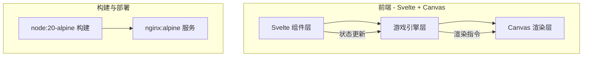
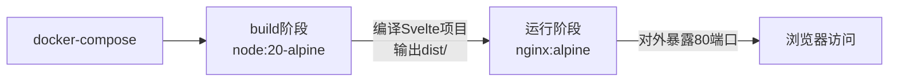

## 1. 架构设计



纯前端架构，无后端。Svelte负责UI组件与状态管理，游戏核心逻辑在TypeScript模块中实现，Canvas负责迷宫与角色渲染。Docker构建阶段用node:20-alpine编译Svelte项目，运行阶段用nginx:alpine托管静态资源。

## 2. 技术说明

- 前端框架：Svelte + TypeScript
- 构建工具：Vite
- 样式：CSS变量 + 全局样式（霓虹风格），不使用Tailwind
- 渲染：HTML5 Canvas 2D
- 状态管理：Svelte stores（writable）
- 初始化工具：npm create vite@latest
- 后端：无
- 数据库：无
- 部署：Docker Compose（node:20-alpine 构建 + nginx:alpine 服务）

## 3. 项目结构

```
src/
  lib/
    maze.ts          # 迷宫生成算法（DFS递归回溯）
    game.ts          # 游戏主循环、碰撞检测、状态管理
    enemy.ts         # 敌人巡逻逻辑
    player.ts        # 玩家移动与状态
    items.ts         # 钥匙与道具生成/拾取
    powerup.ts       # 加速/无敌buff管理
    scoring.ts       # 得分与倍率计算
    levels.ts        # 关卡配置（尺寸、敌人数量等）
    renderer.ts      # Canvas渲染器
    types.ts         # 类型定义
  components/
    GameCanvas.svelte    # 游戏Canvas组件
    HUD.svelte           # 顶部信息栏
    StartScreen.svelte   # 开始界面
    LevelComplete.svelte # 通关弹窗
    GameOver.svelte      # 失败弹窗
    PowerUpBar.svelte    # 道具状态栏
  stores/
    gameStore.ts     # 游戏全局状态
  App.svelte
  main.ts
```

## 4. 路由定义

| 路由 | 用途 |
|------|------|
| / | 游戏主页面（包含所有界面状态切换） |

单页面应用，通过Svelte状态切换不同界面（开始/游戏中/通关/失败），无需路由。

## 5. 核心模块设计

### 5.1 迷宫生成（DFS递归回溯）

- 每关根据配置生成 rows × cols 的网格
- DFS随机打通墙壁生成通路
- 起点固定左上角，终点固定右下角
- 在通路上随机放置钥匙、道具、敌人巡逻路径

### 5.2 关卡配置

| 关卡 | 迷宫尺寸(rows×cols) | 钥匙数量 | 敌人数量 | 道具数量 |
|------|---------------------|---------|---------|---------|
| 1 | 9×9 | 3 | 1 | 2 |
| 2 | 11×11 | 4 | 2 | 3 |
| 3 | 13×13 | 5 | 3 | 3 |
| 4 | 15×15 | 6 | 4 | 4 |
| 5 | 17×17 | 7 | 5 | 4 |

### 5.3 敌人巡逻

- 每个敌人分配一条固定路径（迷宫中的连续通路段）
- 沿路径来回移动，移动速度固定
- 与玩家碰撞检测：格子坐标重叠即判定碰撞

### 5.4 道具系统

- 加速道具：拾取后移动速度+50%，持续10秒，最多叠加3层（即最高2.5倍速）
- 无敌道具：拾取后10秒内碰撞敌人不失败，最多叠加3层（持续时间刷新+5秒/层）
- 同类道具效果叠加：第1层10秒，第2层+5秒，第3层+5秒，超过3层按3层算

### 5.5 得分与倍率

- 基础得分：拾取钥匙+100，拾取道具+50，通关+500
- 倍率机制：连续拾取道具且未被敌人碰到，倍率依次+0.5（1x → 1.5x → 2x → ...）
- 被敌人碰到（无论是否无敌），倍率重置为1x
- 得分 = 基础得分 × 当前倍率

## 6. Docker部署架构



### 6.1 Dockerfile（多阶段构建）

- 阶段1：node:20-alpine，npm install + npm run build
- 阶段2：nginx:alpine，拷贝dist到/usr/share/nginx/html

### 6.2 docker-compose.yml

- 服务：web
- 构建：当前目录Dockerfile
- 端口映射：80:80
- 一键启动：docker-compose up --build
